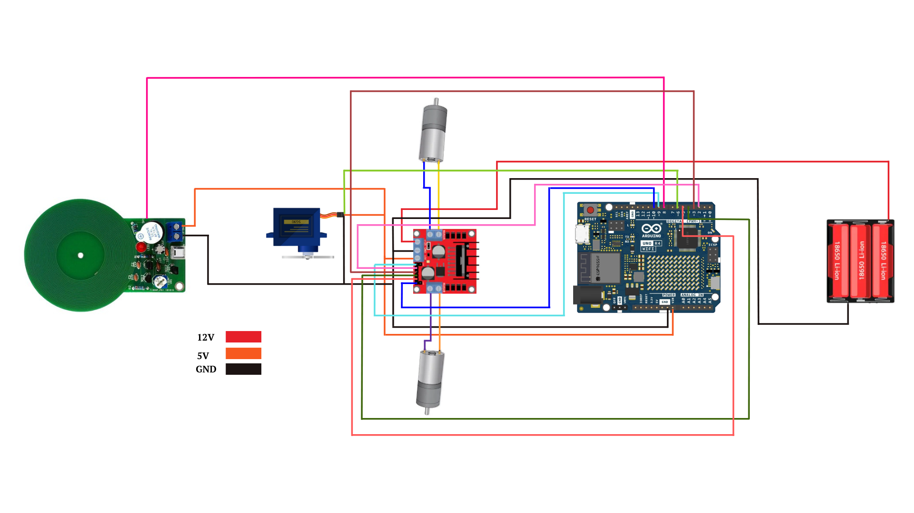
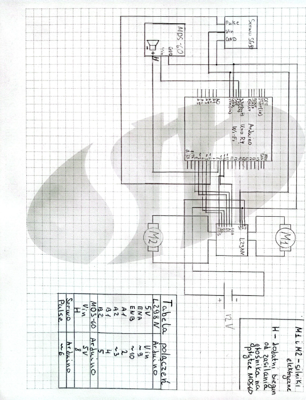
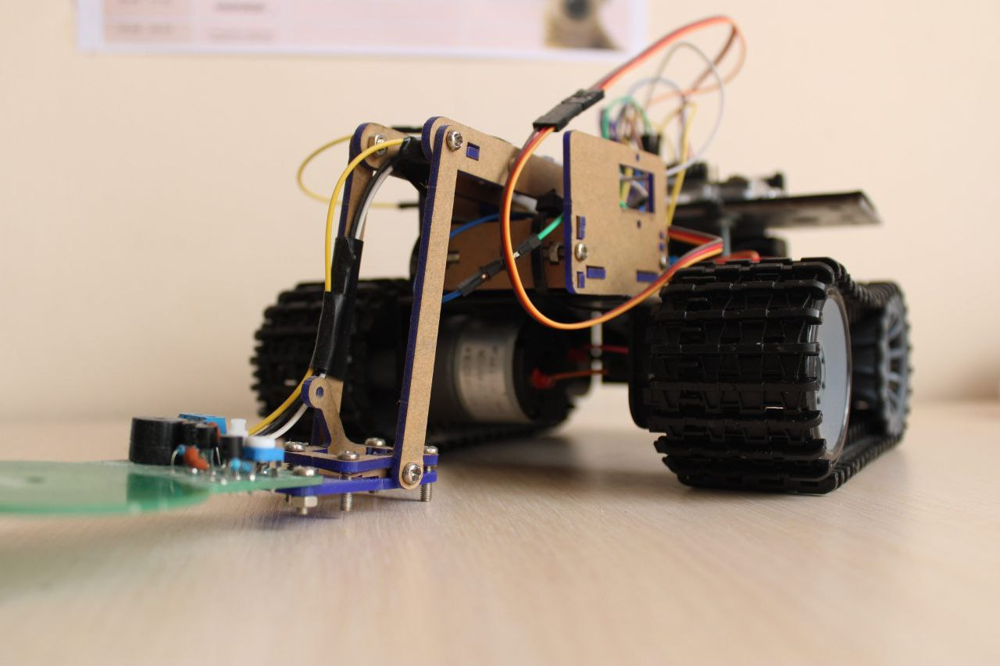
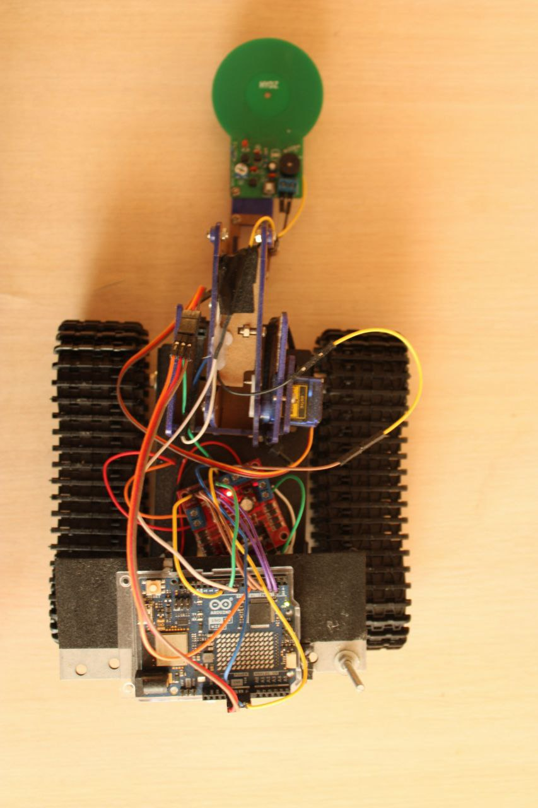

## Overview

**XCrawled RPBT** is a DIY robot built on the DFRobot Black Gladiator chassis. It combines remote control, GPS-based localization, and metal detection in one functional platform. The project leverages Arduino, WiFi communication, and a web interface to interact with the robot in real-time.

## Features

-  **Remote-controlled Robot** – Based on the DFRobot Black Gladiator
-  **IP-based Localization** – Uses [ip-api.com](http://ip-api.com) for geo-positioning
-  **WiFi Communication** – Connects and transmits data over WiFi
-  **GPS Coordinate Logging** – Sends longitude and latitude to Supabase
-  **Metal Detection** – Equipped with an MDS-60 metal detector
-  **Web Control Interface** – Interactive browser-based control panel

---

## Hardware Components

| Component             | Description                          |
|----------------------|--------------------------------------|
| Chassis              | DFRobot Black Gladiator              |
| Motors               | Crawled and DC Motors                |
| Motor Driver         | L298N                                |
| Microcontroller      | Arduino Uno 4 WiFI                   |
| Power Supply         | 12V Battery                          |
| Metal Detector       | MDS-60                               |
| Communication        | Arduino Uno 4 WiFI                   |

---

## Architecture

The robot architecture includes:

- **Arduino Uno**: Main controller and communication and localization (via IP)
- **L298N Driver**: For motor control
- **MDS-60 Sensor**: For metal detection
- **Supabase**: Backend for GPS data storage
- **Web Interface**: User interface to control and monitor the robot

---

---

## Setup Instructions

### 1. Hardware Assembly

1. Assemble the Black Gladiator chassis and mount the motors.
2. Connect motors to the L298N driver.
3. Wire the driver to Arduino .
4. Connect MDS-60 to the Arduino (analog/digital pin depending on configuration).

### 2. Arduino Programming

- Upload the code in `arduino/main.ino` using the Arduino IDE.
- Ensure you have installed all libraries
- Add your WiFi network information

### 3. Supabase Setup

- Create a new Supabase project.
- Set up a table with fields for `longitude`, `latitude`, and `timestamp`.
- Replace Supabase keys and API URLs in your Arduino code.
- 

---

## Localization with IP-API

Robot location is determined using [ip-api.com](https://ip-api.com), which returns approximate latitude and longitude based on IP address. While this method is not GPS-accurate, it is useful in WiFi-only environments.

---

## Images

### Robot Photo

### Top View of the Robot

---

## License

This project is open-source under the MIT License. See the `LICENSE` file for details.

---

